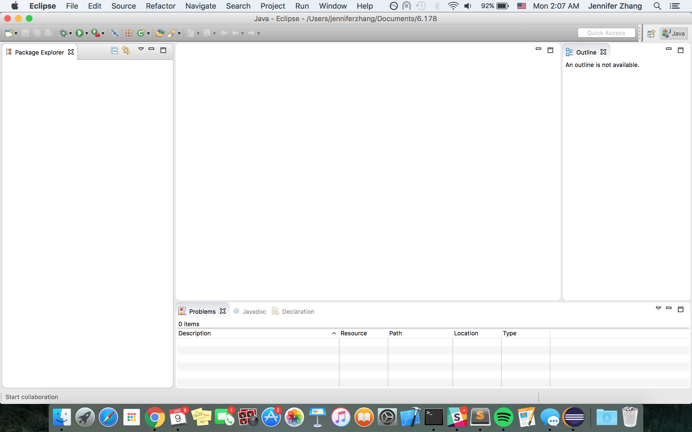
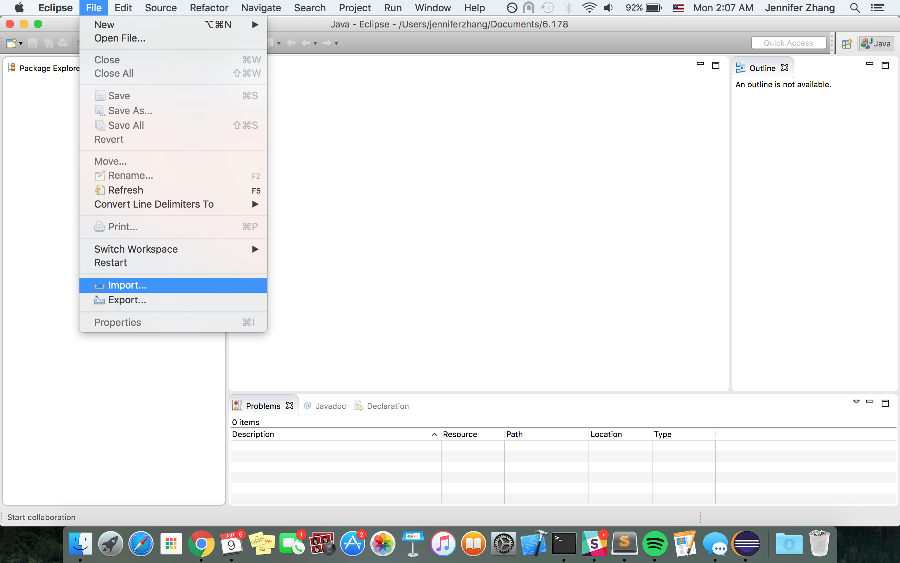
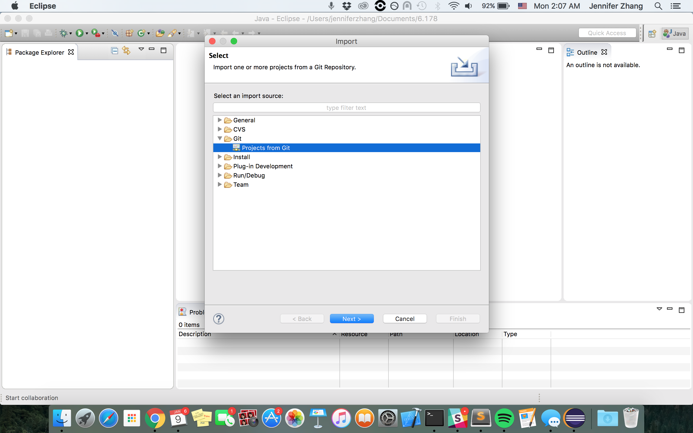
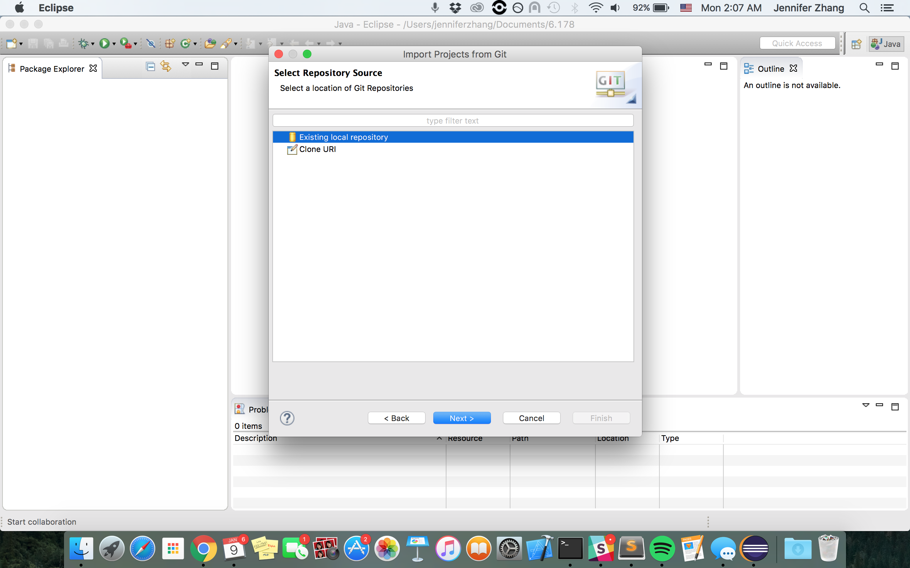
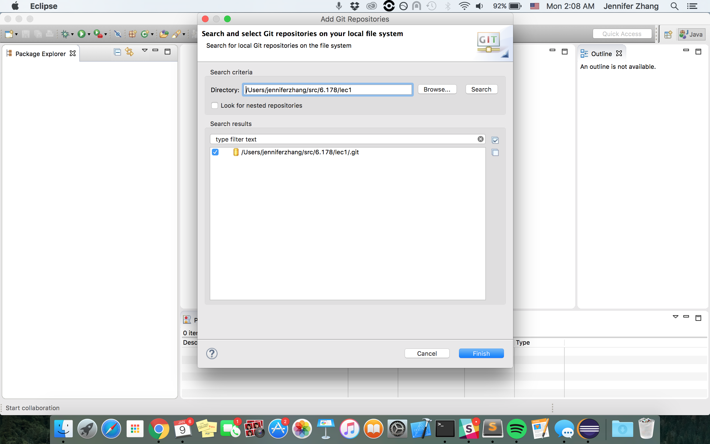
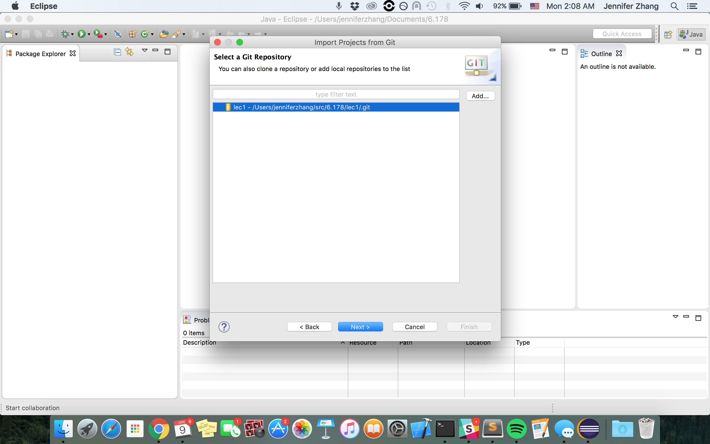
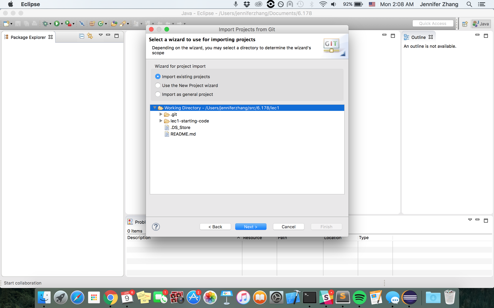
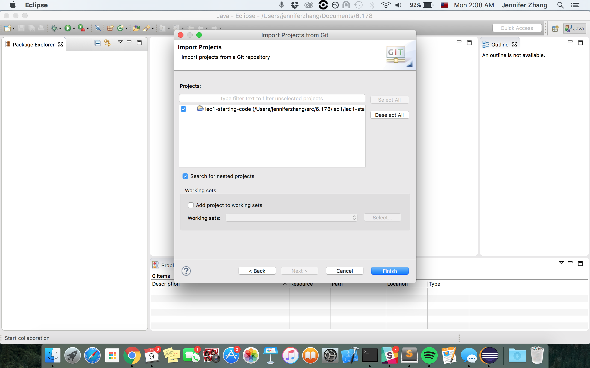
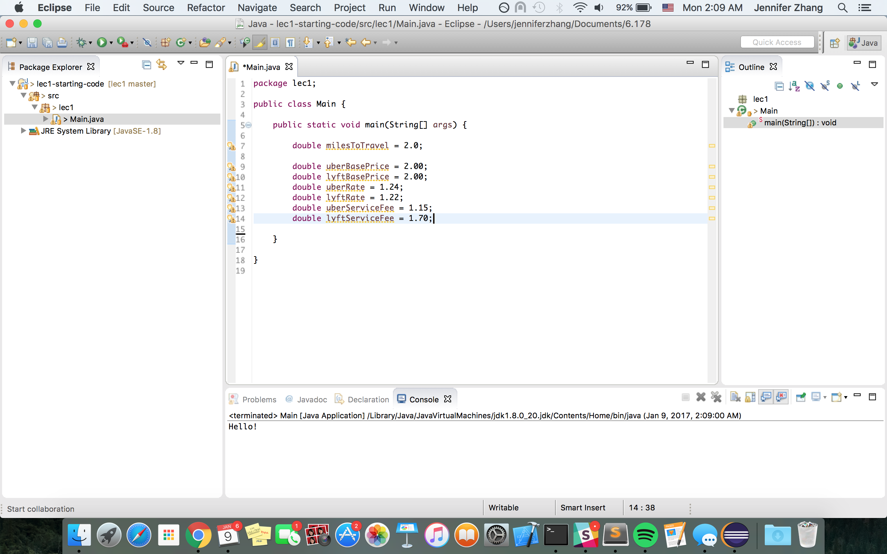

# 6.178 Lecture #1 - Java Basics

## Logistics
* Lectures are every Monday, Wednesday, and Friday from 11am to 1pm in 2-190.
* Office Hours are every Tuesday and Thursday from 11am - 4pm in 34-302 and 34-304.
* Feel free to ask questions on the [Piazza](https://piazza.com/class/ixbeg17oz79vm).
* Email the staff any questions at 6178staff@mit.edu.
* First  problem  set  will  be  out  tonight. The first pset is due on __Friday, January 13th at 11:59pm__

## Git
What is Git? __Git__ is a version control system to track changes in files. With version control, you can collaborate with several people and you can keep track of who made changes to what. Git stores all these changes and the files in a data structure called a __repository__ or __"repo"__. In this class, we're not going to have multiple collaborators on a single repository. We'll go in depth with all the details about Git in a future class.

### SSH Keys
An __SSH Key__ will allow you to push and clone repos without typing your username and password each time.
* First, sign up for an MIT Github Enterprise account at github.mit.edu
* [Check if you have an existing SSH key](https://help.github.com/enterprise/2.5/user/articles/checking-for-existing-ssh-keys/).
  * If you don't have an SSH key, [generate one](https://help.github.com/enterprise/2.5/user/articles/generating-a-new-ssh-key-and-adding-it-to-the-ssh-agent/).
* [Add your SSH key](https://help.github.com/enterprise/2.5/user/articles/adding-a-new-ssh-key-to-your-github-account/) to your Github MIT Enterprise Account.
  * Make sure you are doing this to your account settings at github.mit.edu NOT github.com. 

### Cloning This Repo
* Mac/Linux users: open Terminal. Windows: open Git Bash.
* Dedicate a directory for 6.178 lectures and problem sets. For example:
  * `cd ~/Documents`
  * `mkdir 6.178`
* Go into that directory: `cd ~/Documents/6.178`
* Clone the repo: `git clone https://github.mit.edu/6178-2017/lec1.git` or `git clone git@github.mit.edu:6178-2017/lec1.git`
  * You should not need to put in your username and password.
  * Type `'yes'` when it asks you to answer either `'yes'` or `'no'`.
  * If you have any authentication errors, make sure your SSH key is working properly. Ask a TA for help. 
* Go into the repo: `cd lec1`

## Eclipse Runthrough
You should have already installed JDK and Eclipse. If not, please follow steps 1, 2, and 5 [here](http://web.mit.edu/6.005/www/fa16/getting-started/).
### Workspace
A __workspace__ contains all your projects. I recommend making a workspace for 6.178. It can be the same directory as the directory you are storing all the repositories.

You can select a folder to designate as your workspace. Click "Browse" to pick that folder. Once you're done picking that folder click "Ok".

<div style="text-align: center"></div>

This is what Eclipse should look like once you have your workspace open.

<div style="text-align: center"></div>

### Importing this repo to Eclipse
Go to _File > Import_.



Select _Projects from Git_ under _Git_. Then select Next.


Select _Existing local repository_. Then select Next.


Click on the Add button. You should get the screen below. Click on Browse and find the folder of the Github repo. The folder should be wherever you cloned the repo. Make sure the `.git` file is checkmarked and click Finish.


Click on the lec1 folder and click Next.


Make sure _Import Existing Projects_ and _Working Directory_ are selected. Then select Next.


Make sure the repo is selected and select Finish.


This is what Eclipse should look like for you after you successfully import the repo. The left panel is your __Package Explorer__. Here you can find all your packages (how Java organizes each program). Each package represents a different program in your workspace. The right panel is your __Outline__. The Outline tells you what methods, variables, etc. are in each file; you can quickly jump to them when you click on them. The bottom panel will be helpful for debugging as it has the __Console__. The center area is where you will be viewing files.


## Java Basics
We'll make a lot of comparisons between Java and Python. If you want to learn more about Java, I recommend going through the [Oracle Java Tutorials](https://docs.oracle.com/javase/tutorial/java/nutsandbolts/index.html).

### Standard Output
```
System.out.println("Hello World!");
System.out.printf("Hello Word, it's %d!", 2017);
```

This is the equivalent to printing in Python. We can also print with formatting for variables.

### Types
Defining variables is more declarative than in Java than in Python. In Java, you must define the type of the variable when you define it. Stylistically, you usually [camel case](https://msdn.microsoft.com/en-us/library/x2dbyw72(v=vs.71).aspx) variable names where the first letter of the name is lowercased and every subsequent concatenated word is captialized.

#### Primitive Types
Primitive types are typically lowercased.
```
int age = 22;
long bigNumber = 201719292;
boolean itsCold = true;
double temperature = 40.5;
char firstInitial = 'J';
```
* `int` (for integers like 5 and -200, but limited to the range ± 2^31, or roughly ± 2 billion)
* `long` (for larger integers up to ± 2^63)
* `boolean` (for true or false)
* `double` (for floating-point numbers, which represent a subset of the real numbers)
* `char` (for single characters like 'A' and '$')

#### Object Types
Object types are typically uppercased. One we will use a lot is `String`.
```
String name = "Jennifer";
```

### Operations
Operations are similar in Java to those in Python.
```
int a;
a = 1 + 1; // Addition 
a = 2 - 1; // Subtraction
a = 2 * 3; // Multiplication
a = 4 / 2; // Division (Remember int division still occurs in Java!)
```

In addition, there's a shorthand for incrementing or decrementing a variable.
```
int a = 1;
a ++; // Increments a by 1
a --; // Decrements a by 1
```

### Static Checking
Java uses __static checking__ in which types of variables are known at compile time (before the program runs). Eclipse is able to find errors as you type code. In Python, checking for errors is delayed to runtime (when the program is running). This is called __dynamic checking__.

Try typing the following in your file in Eclipse. It should give you an error:
```
"5" * "5";
```

### Keywords
```
static int age = 22;
final char firstInitial = 'J';
```
* `static` is a keyword used when declaring a variable that can be accessed without the instantiation of a class.
* `final` is a keyword used when declaring a variable that can only be assigned once.

You'll learn more about these two keywords in future lectures.

### If-Else Statements
```
if (condition) {
 // Do something.
} else if (condition) {
 // Do something else.
} else {
 // Default case.
}
```
### For Loops
```
for(int i=0; i < 10; i++) {
 // Do something.
}
```
### While Loops
```
int j = 0;
while(j < 10) {
 // Do something.
 j++;
}
```

