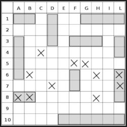

# 6.178 Problem Set 1 - Battleship Utility Functions

You will complete three problem sets this IAP, each of which will compose part of a larger project: creating your own Battleship game!

## Running the tests
The starting code contains tests that will verify the correct output of your code. You can run the tests from the Run drop-down menu: `Run > Run As > Java Application`.

At first, running the code will result in errors like the following:

```
Exception in thread "main" java.lang.UnsupportedOperationException: Main.squareToColumnNumber() unimplemented
	at battleship.Main.squareToColumnNumber(Main.java:26)
	at battleship.Main.main(Main.java:182)
```

When you are done implementing each of the parts of the problem set, make sure to remove the line containing `throw new UnsupportedOperationException("... unimplemented")` and the exception should no longer occur.

If your code passes all of the tests, it will display the message `All tests passed!`

### Reading stack traces

If your code produces an incorrect output, you will get a printout on the console similar to the following:

```
Expected true, got false
java.lang.Exception
	at battleship.Main.assertEquals(Main.java:187)
	at battleship.Main.assertEquals(Main.java:198)
	at battleship.Main.main(Main.java:281)
Failed 1/23 tests
```

The first line tells you what output the test was expecting, and what it actually got from your code. The next few lines tell you _where_ the error occurred. The lines containing `assertEquals` are just due to the way the tests are implemented. The first line with `Main.main` reveals the line number of the test that failed: you can click on the `filename:lineno` link to go to that test and determine what inputs and outputs your code is failing at.

### A reminder

`Main.java` contains the following comment:

```java
// DO NOT EDIT BELOW THIS COMMENT
//
// All code below this comment is used to check your answers
// if you modify it, it may produce incorrect results, and you may
// get wrong answers!
```

Do not ignore it.

## About Battleship
Battleship is a game that involves 2 players that have __two 10 by 10 boards__ and __five ships__ each. These 5 ships are the Carrier (5), the Battleship (4), the Cruiser (3), the Submarine (3), and the Destroyer (2). The number in parentheses next to the name represents how long the ship is or how many squares the ship spans.

<div align="center"></div>

One board records a player's ships and their opponent's shots. One board records the shots the player has taken. From image above, you can see that each square has a letter and a number associated with it representing its column and row respectively. For example, "A1" represents the upper-left square in the corner.

The game starts when both players have finished placing all their ships on their board. Ships must be placed either horizontally or vertically. Then, the players take turns to announce the square in their opponent's board which is to be shot at. The opposing player will then announce if that shot at the target square was a hit or a miss. A ship is considered sunk when every square it spans is hit. The game continues until one player's ships are all sunk.

If you are not familiar with Battleship or want to know more, please reference the [Wikipedia article](https://en.wikipedia.org/wiki/Battleship_(game)).

## Data Types in Problem Set
You'll find the two data types below in the problem set package as `Direction.java` and `ShipType.java`. Both are of the type [enum](https://docs.oracle.com/javase/tutorial/java/javaOO/enum.html) which is a special data type that enables for a variable to be a set of predefined constants. Internally the class represents the different constants as integers.

### `Direction` Enum
`Direction` represents the direction that a given ship is aligned, either horizontally or vertically. A ship's `Direction` can either be `HORIZONTAL` or `VERTICAL`.

### `ShipType` Enum
Each ship spans a different number of squares as seen from the table below.

| `ShipType` |  Length |
|---|---|
| Carrier | 5 |
| Battleship | 4 |
| Cruiser | 3 |
| Submarine | 3 |
| Destroyer | 2 |

`ShipType` is also an enum that represents a type of the ship which is one of the predefined ship types: `CARRIER`, `BATTLESHIP`, `CRUISER`, `SUBMARINE`, `DESTROYER`.

## Problem 0: `ShipType.length`
__TODO:__ Complete the `length` method in `ShipType.java` which returns the length of a given `ShipType`. You can find the lengths of `ShipType`s in the table above. If the given `ShipType` is not a valid `ShipType` return 0.

## Problem 1: `squareToColumnNumber`
A square is one of the tiles on a board. A square has both a letter and a number associated with it as seen from the picture above in the About Battleship section. For example, "A1" represents the square in upper-left hand corner. The letter represents the column the square is in.

__TODO:__ Complete the `squareToColumnNumber` method in `Main.java` which returns the 0-based integer column number that the square is in. Below are example input/output pairs:

```
squareToColumnNumber(“A4”);
```
Output: `0`

```
squareToColumnNumber(“D1”);
```
Output: `3`

## Problem 2: `squareToRowNumber`
Once again, a square is one of the tiles on a board. A square has both a letter and a number associated with it as seen from the picture above in the About Battleship section. For example, "A1" represents the square in upper-left hand corner. The number represents the row the square is in.

__TODO:__ Complete the `squareToRowNumber` method in `Main.java` which returns the 0-based integer row number that the square is in. Below are example input/output pairs:

```
squareToColumnNumber("A1");
```
Output: `0`

```
squareToColumnNumber(“D6”);
```
Output: `5`

## Problem 3: `squaresShipSpans`
__TODO:__ Complete the `squareShipSpans` method in `Main.java` which returns a 2d integer array of coordinates of squares that the given ship spans. The elements of the array should be in the form of `[column, row]`. The method's spec details the arguments the method needs. Below are example input/output pairs:

```
int shipColumn = 0;
int shipRow = 0;
Direction shipDirection = Direction.HORIZONTAL;
ShipType shipType = ShipType.BATTLESHIP;

squareShipSpans(shipColumn, shipRow, shipDirection, shipType);
```
Output: `{ {0, 0}, {1, 0}, {2, 0}, {3, 0} }`

```
int shipColumn = 0;
int shipRow = 0;
Direction shipDirection = Direction.VERTICAL;
ShipType shipType = ShipType.CARRIER;

squareShipSpans(shipColumn, shipRow, shipDirection, shipType);
```
Output: `{ {0, 0}, {0, 1}, {0, 2}, {0, 3}, {0, 4} }`

## Problem 4: `isHit`
__TODO:__ Complete the `isHit` method in `Main.java` which returns `true` if and only if the shot will hit the ship. The method's spec details the arguments the method needs. Below is an example input/output pair:

```
int shotColumn = 1;
int shotRow = 0;
int shipColumn = 0;
int shipRow = 0;
Direction shipDirection = Direction.HORIZONTAL;
ShipType shipType = ShipType.CARRIER;

isHit(shotColumn, shotRow, shipColumn, shipRow, shipDirection, shipType);
```
Output: `true`

```
int shotColumn = 2;
int shotRow = 1;
int shipColumn = 0;
int shipRow = 0;
Direction shipDirection = Direction.HORIZONTAL;
ShipType shipType = ShipType.CARRIER;

isHit(shotColumn, shotRow, shipColumn, shipRow, shipDirection, shipType);
```
Output: `false`

## Problem 5: `shipInBounds`
__TODO:__ Complete the `shipInBounds` method in `Main.java` which returns `true` if and only if the entire ship is within the boundaries of the board. The method's spec details the arguments the method needs. Below are example input/output pairs:

```
int height = 10;
int width = 10;
int column = 0;
int row = 0;
Direction shipDirection = Direction.HORIZONTAL;
ShipType shipType = ShipType.CARRIER;

shipInBounds(height, width, column, row, shipDirection, shipType);
```
Output: `true`

```
int height = 10;
int width = 10;
int column = 8;
int row = 0;
Direction shipDirection = Direction.VERTICAL;
ShipType shipType = ShipType.BATTLESHIP;

shipInBounds(height, width, column, row, shipDirection, shipType);
```
Output: `true`

## Problem 6: `shotInBounds`
__TODO:__ Complete the `shotInBounds` method in `Main.java` which returns `true` if and only if the shot is within the boundaries of the board. The method's spec details the arguments the method needs. Below are example input/output pairs:

```
int height = 10;
int width = 10;
int column = 4;
int row = 2;
shipInBounds(height, width, column, row);
```
Output: `true`

```
int height = 10;
int width = 10;
int column = 4;
int row = 10;
shipInBounds(height, width, column, row);
```
Output: `false`

## Problem 7: `printBoard`
__TODO:__ Complete the `printBoard` method in `Main.java` which prints the board to the Console. Each square is separated with `'|'`. Mark each hit square with "X" and each missed square with "O". The board given is a 2d integer array of `true`s and `false`s where `true` represents a hit and `false` represents a miss. We're assuming all spaces are either a hit or a miss.

```
int[][] board = {
	{true, true, true, false, true},
	{true, false, false, true, false},
	{false, false, false, true, true},
	{false, true, true, true, false},
	{false, false, false, false, false}
};
printBoard(board);
```
Output:
```
X|X|X|O|X
X|O|O|X|O
O|O|O|X|X
O|X|X|X|O
O|O|O|O|O
```
